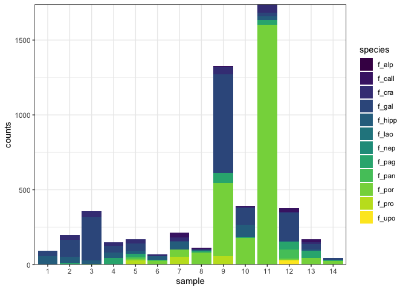
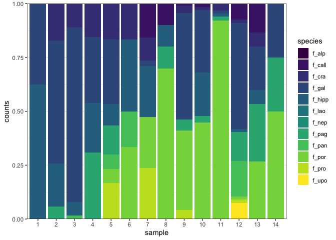
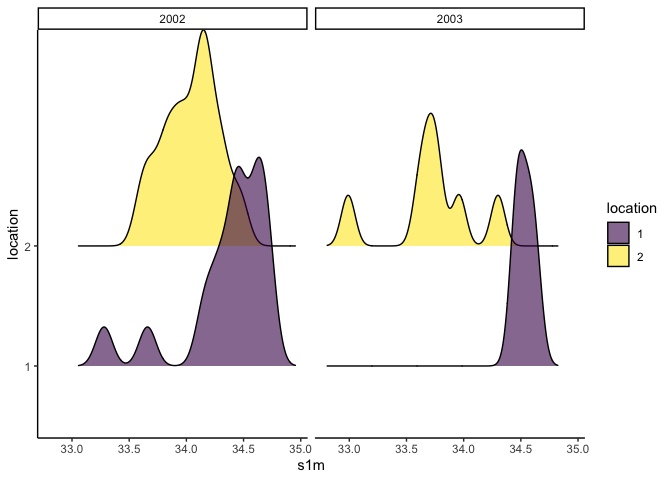
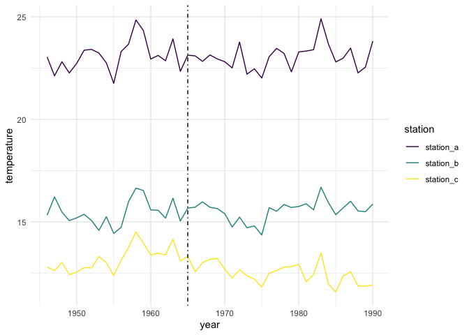

# Week 06 - Homework   {ggplot} part II

Welcome to your assignment for **week 6**. As usual, **Clone** this repo into your own :computer:  using RStudio, as we saw in class.

For this week's assignment you will need to create a short **"report" in an rmarkdown** format with its associated `.md` and `.html` outputs. In this report you will guide me through the process of replicating the following items. Feel free to add as much text as you want explaining your steps.

## The data

All data for this assignment is directly taken or modified from the Zur et al (2007) book [1](https://www.springer.com/gp/book/9780387459677)

For the first 3 figures we will use a dataset consisting of species counts for a number of decapod species (those starting with “f_”) measured in 45 samples. Abiotic data for those sampling locations is also provided (eg, the temperature and salinity at 1m: t1m, s1m)

For the fourth figure, we will use a dataset of mean annual sea surface temperatures (sst) collected at three different stations.

## Figure 1

With the decapod data, create the following figure showing species counts with total counts per site

<!-- -->

## Figure 2

With the decapod data, create the following figure showing the proportion of species counts counts per site

<!-- -->

## Figure 3

With the decapod data, create the following density-ridge plot showing the salinity concentration at 1 m (variable named “s1m”) at the two sampled locations in the two sampling years.

<!-- -->

## Figure 4

Using the sea surface temperature data, generate this time series plot showing the three different stations

<!-- -->

## wrap-up

In addition to being shown inthe final report, each figure should be saved in `.pdf` format with a width of 190 mm

Finally, once you have completed the exercises, as usual:

- Once you are done with the R script files, save the changes, make sure scripts are properly saved in te **R** folder.
- Commit all the changes to the *repo/R project* (remember to write a commit mesage!)
- **Push** all changes back to **GitHub**
- Go to GitHub and check that it all worked out

## A few hints

- Make sure to save your `.rmd` file in the rmarkdown folder **before** you knit your file
- You will need to use the **{here}** package to correctly load the ditch data into the `.Rmd` file as well as to save the figures.

As always, feel free to use [the Issues](https://github.com/UM-R-for-EnvSci-Registered-Student/General-Discussion/issues) section of the of [General Discussion](https://github.com/UM-R-for-EnvSci-Registered-Student/General-Discussion) repo to ask any questions you might have or to share anny issues you come across. 

Note for those of you **still waiting for a final Git/GitHub set up**. You can still use the green button labelled "code" to download a zip version of the repository. You can unzip this anywhere in your computer and open the R project by double clicking the blue cube .RProj file. then you will be able to work on the project, edit and save like you would on any other R project.The only difference, for now, is that you will not be able to "push" the changes back to github, as that folder is not being tracked by Git/GitHub. We will need to find a separate solution for you to get this folder back to me once you are done with the asignment (e.g. zip eail attachment or dropbox/google drive/onedrive link)

*Happy coding!*

Pepe

